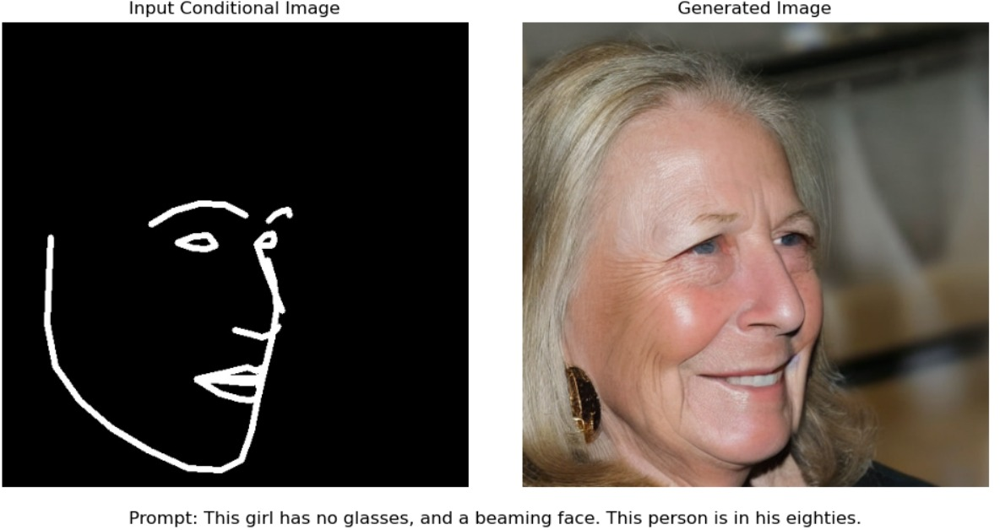
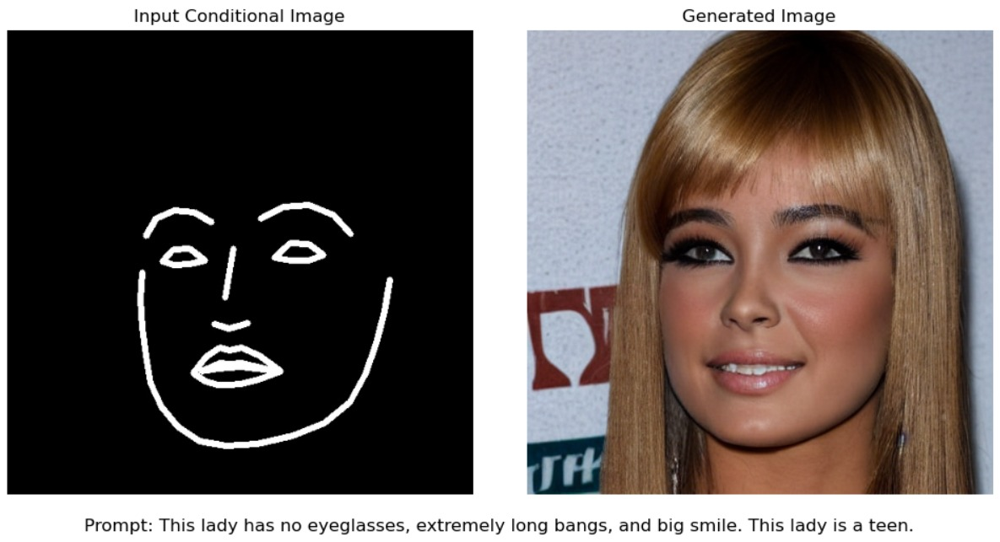

# GuidedFace: Generating Face Images Guided by Input Facial Landmarks and Prompts using ControlNet




GuidedFace is a modified version of Stable Diffusion to generate realistic face images based on specific input facial landmarks and text prompts. The model uses [ControlNet](https://github.com/lllyasviel/ControlNet/tree/main), a neural network architecture that allows for precise control over the generated output by conditioning it on user-defined input conditioning image and prompts. This enables the generation of highly customized and coherent face images, where the shape, expression, and features of the face are guided by the input conditioning image as shown in the above figures.


## Setup
The required libraries can be setup by following the instruction given in the [ControlNet repo](https://github.com/lllyasviel/ControlNet/tree/main). Then, use the below commands to install additional libraries:
```
pip install dlib
pip install torch-fidelity
```


## Dataset

GuidedFace has been trained using a custom dataset that has input conditioning image, target image and prompt created based on the [CelebA-HQ dataset](https://mmlab.ie.cuhk.edu.hk/projects/CelebA/CelebA_Dialog.html). The modified dataset is made available in our HuggingFace repo. Use the below commands to load the dataset for training or testing the model.

```
cd ./training

wget https://huggingface.co/datasets/gokulg02/GuidedFace_dataset/resolve/main/guided_face.tar.gz

tar -xvzf guided_face.tar.gz  
rm guided_face.tar.gz 
cd ..
```

Run the below command to ensure that the dataset has been saved:
```
 python tutorial_dataset_test.py
 ``` 


## Training

The training of GuidedFace was performed using an A500 GPU and takes approximately 12 hours in total. We have made the trained model available on our HuggingFace repository, so you can skip the training step if you prefer. However, if you'd like to train the model from scratch, you can use the commands below. For more details on training, please refer to the [training tutorial in ControlNet repository](https://github.com/lllyasviel/ControlNet/blob/main/docs/train.md).

```
cd ./models
wget https://huggingface.co/stable-diffusion-v1-5/stable-diffusion-v1-5/resolve/main/v1-5-pruned.ckpt

cd ..
python tool_add_control.py ./models/v1-5-pruned.ckpt ./models/control_sd15_ini.ckpt

python ./tutorial_train.py 
```

Use the below command to download the pre-trained model from our HuggingFace repo directly.

```
wget -P ./models https://huggingface.co/gokulg02/GuidedFace/resolve/main/model-epoch%3D02-step%3D21900.ckpt
```

## Inference

We have included python notebooks to test the inference of our models and benchmark it using metrics like inception score, FID, and similarity score. The facial feature extractor of dlib is used to obtain the facial landmark of the generated image and compare it with input conditional image. The model used by it can be downloaded using:

```
wget -P ./models https://huggingface.co/spaces/asdasdasdasd/Face-forgery-detection/resolve/ccfc24642e0210d4d885bc7b3dbc9a68ed948ad6/shape_predictor_68_face_landmarks.dat
```

The [Inference.ipynb notebook](https://github.com/gokulg02/GuidedFace/blob/main/Inference.ipynb) can be used to run inference for a single prompt and conditonal input. The benchmarking of the trained model in terms of performance metrics is done by generating multiple images. Use the below comman to generate 2000 unique samples for benchmarking:

```
 python inference_generate_samples.py
```
Finally, to compute the [compute_inference_metrics.ipynb notebook](https://github.com/gokulg02/GuidedFace/blob/main/compute_inference_metrics.ipynb) can be used to compute the FID, inception score and similarity score. 
